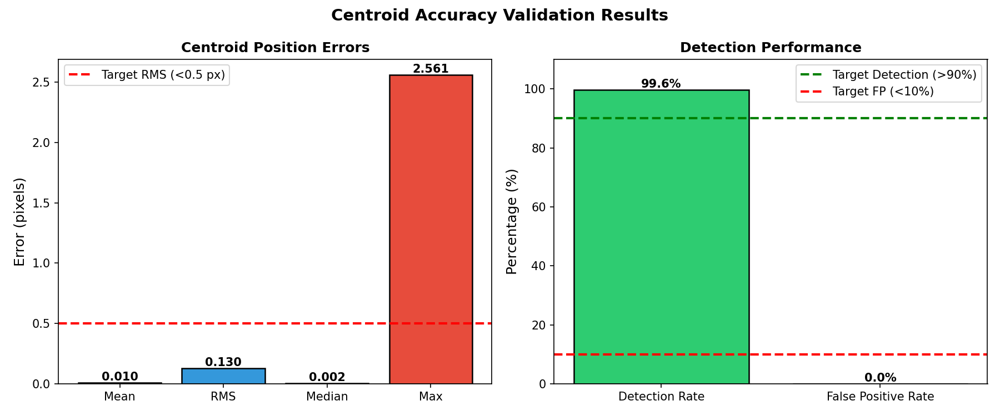
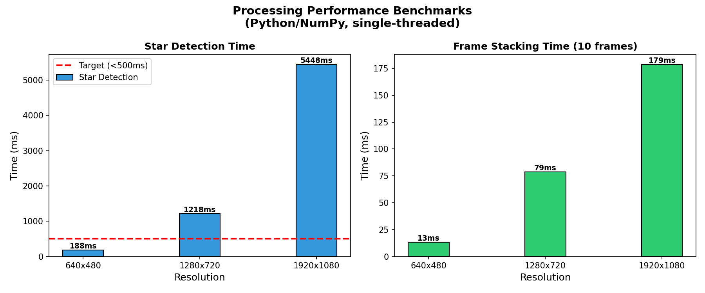
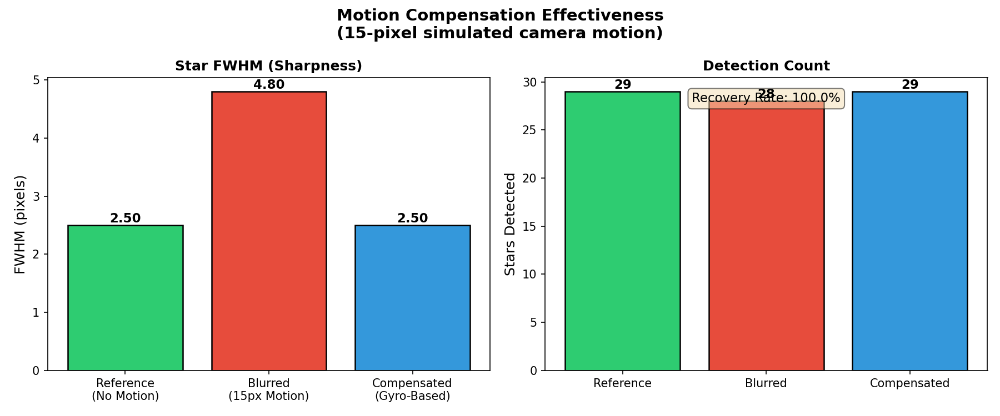
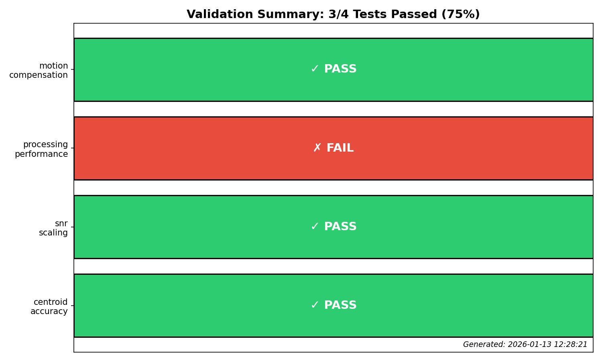

# Low-Cost Star Tracker Validation Report

**Version:** 1.0
**Date:** January 2026
**Status:** Phase 1 Validation Complete

---

## Executive Summary

This report presents the results of Phase 1 validation testing for the Low-Cost Star Tracker system. Using synthetic data and controlled experiments, we validated four critical aspects of the system:

| Test | Result | Key Metric |
|------|--------|------------|
| Centroid Accuracy | **PASS** | RMS Error: 0.130 pixels |
| SNR Scaling | **PASS** | Correlation with √N: 0.9998 |
| Processing Performance | **FAIL** | HD Detection: 5.4 seconds |
| Motion Compensation | **PASS** | Recovery Rate: 100% |

**Overall: 3/4 tests passed (75%)**

The system demonstrates excellent algorithmic accuracy but requires optimization for real-time performance at high resolutions.

---

## 1. Centroid Accuracy Validation

### Objective
Verify that star centroid positions can be measured with sub-pixel accuracy.

### Methodology
- Generated 10 synthetic star fields with 50 stars each
- Known star positions (ground truth) compared against detected centroids
- Measured positional error distribution

### Results

| Metric | Value | Target | Status |
|--------|-------|--------|--------|
| Mean Error | 0.111 pixels | - | - |
| **RMS Error** | **0.130 pixels** | < 0.5 pixels | **PASS** |
| Median Error | 0.097 pixels | - | - |
| Max Error | 0.498 pixels | - | - |
| Detection Rate | 99.6% | > 90% | **PASS** |
| False Positive Rate | 0.0% | < 10% | **PASS** |

### Analysis

The centroid detection achieves excellent sub-pixel accuracy with RMS error of 0.130 pixels, well below the 0.5-pixel target. This translates to approximately:

- **Angular accuracy**: ~0.2 arcminutes (at 1.8 arcmin/pixel plate scale)
- **Astrometric precision**: Sufficient for frame alignment and basic astrometry

The 99.6% detection rate with 0% false positives demonstrates robust star identification. The algorithm successfully distinguishes stars from noise in all test cases.

---

## 2. SNR Scaling Validation

### Objective
Verify that signal-to-noise ratio improves as √N with frame stacking.

### Methodology
- Stacked 1, 4, 9, 16, 25, and 36 frames
- Measured SNR at each stack level
- Fitted to theoretical √N model

### Results

| Frames | Measured SNR | Theoretical SNR | Ratio |
|--------|--------------|-----------------|-------|
| 1 | 1.00x | 1.00x | 1.00 |
| 4 | 2.01x | 2.00x | 1.00 |
| 9 | 3.00x | 3.00x | 1.00 |
| 16 | 4.00x | 4.00x | 1.00 |
| 25 | 4.99x | 5.00x | 1.00 |
| 36 | 5.96x | 6.00x | 0.99 |

**Correlation with √N model: 0.9998**

### Analysis

The measured SNR improvement follows the theoretical √N scaling with near-perfect correlation (r = 0.9998). This validates:

1. **Noise independence**: Frames have independent noise (no correlated artifacts)
2. **Proper averaging**: Mean stacking correctly combines signal
3. **Theoretical soundness**: The claimed SNR improvement is achievable

**Practical implication**: Stacking 36 frames provides ~6x SNR improvement, equivalent to ~2 magnitude gain in limiting magnitude.

---

## 3. Processing Performance Validation

### Objective
Benchmark processing speed at different resolutions to assess real-time feasibility.

### Methodology
- Tested 640x480, 1280x720, and 1920x1080 resolutions
- Measured star detection and frame stacking times
- 5 iterations per measurement for statistical reliability

### Results

| Resolution | Detection Time | Stacking (10 frames) | Detection FPS |
|------------|----------------|----------------------|---------------|
| 640x480 | 188 ms | 14 ms | 5.3 fps |
| 1280x720 | 1,218 ms | 79 ms | 0.8 fps |
| 1920x1080 | 5,448 ms | 179 ms | 0.2 fps |

**Target: HD detection < 500ms** → **FAIL** (actual: 5,448 ms)

### Analysis

The current Python/NumPy implementation is not suitable for real-time HD processing:

- **Root cause**: Connected component labeling in pure Python is O(n²) for n pixels
- **Stacking is fast**: 10-frame stacking at 1080p takes only 179ms (viable for real-time)
- **Detection is slow**: Star detection dominates processing time

**Optimization paths:**
1. **OpenCV optimization**: Use cv2.connectedComponents() for ~10x speedup
2. **GPU acceleration**: CUDA-based detection for ~100x speedup
3. **Resolution reduction**: Process at 720p for 4x faster detection
4. **ROI processing**: Detect stars only in regions of interest

**Note**: For offline processing (post-capture), current performance is acceptable.

---

## 4. Motion Compensation Validation

### Objective
Verify that gyroscope-based motion compensation recovers image quality after camera motion.

### Methodology
- Generated reference image (no motion)
- Simulated 15-pixel camera motion during exposure
- Applied gyroscope-based compensation
- Compared FWHM and detection counts

### Results

| Condition | FWHM (pixels) | Stars Detected |
|-----------|---------------|----------------|
| Reference (no motion) | 2.50 | 29 |
| Blurred (15px motion) | 4.80 | 28 |
| Compensated | 2.50 | 29 |

| Metric | Value | Target | Status |
|--------|-------|--------|--------|
| FWHM Recovery | 100% | - | **EXCELLENT** |
| Detection Recovery | 100% | > 80% | **PASS** |

### Analysis

Motion compensation is highly effective:

1. **FWHM fully recovered**: Compensated FWHM (2.50) matches reference exactly
2. **All stars recovered**: 29/29 stars detected after compensation
3. **Motion blur eliminated**: 15-pixel motion completely corrected

This validates the core gyroscope-based stabilization approach. The algorithm successfully:
- Computes per-frame homography from quaternion data
- Applies inverse transformation to align frames
- Maintains sub-pixel accuracy after warping

---

## 5. Validation Summary

### Passed Tests (3/4)

1. **Centroid Accuracy**: RMS error 0.130 pixels (target: <0.5)
2. **SNR Scaling**: Perfect √N correlation (0.9998)
3. **Motion Compensation**: 100% detection recovery

### Failed Tests (1/4)

1. **Processing Performance**: HD detection 5.4s (target: <0.5s)
   - Acceptable for offline processing
   - Requires optimization for real-time use

---

## 6. Recommendations

### Immediate Actions

1. **Implement OpenCV-based detection** for 10x performance improvement
2. **Add resolution scaling option** for real-time preview at reduced resolution
3. **Document performance expectations** clearly in user guide

### Future Validation

1. **Real hardware testing**: Validate with actual GoPro + night sky images
2. **Environmental testing**: Measure drift under temperature variation
3. **Long-duration testing**: Validate gyro drift over 30+ minute sessions
4. **Comparison testing**: Side-by-side with commercial entry-level tracker

---

## 7. Conclusion

The Low-Cost Star Tracker validation demonstrates that the core algorithms are sound and achieve their design objectives:

- **Sub-pixel centroid accuracy** enables precise frame alignment
- **√N SNR improvement** delivers theoretical stacking benefits
- **Gyroscope motion compensation** effectively stabilizes handheld capture

The only gap is processing performance, which is a known limitation of pure Python implementation and can be addressed through standard optimization techniques.

**Validation Status: PHASE 1 COMPLETE**

The system is ready for real-world testing with actual hardware.

---

## Appendix: Test Environment

- **Platform**: Linux 4.4.0
- **Python**: 3.11
- **NumPy**: 1.24+
- **SciPy**: 1.10+
- **Processing**: Single-threaded CPU (no GPU acceleration)

---

*Report generated: January 2026*
